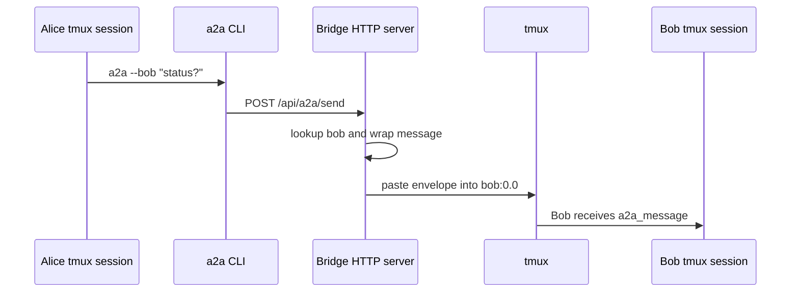

# a2a

`a2a` is a tmux-backed bridge for running several coding agents side by side and letting them talk to each other.

It gives each agent a name, keeps a small HTTP registry of live peers, and delivers messages into the recipient's terminal as an `<a2a_message>` envelope. The normal workflow is simple: start a bridge, spawn a few agents, then ask one agent to message another with the `a2a` CLI.

This package is not an implementation of Google's Agent2Agent protocol. The name here is literal and local: agent-to-agent messaging for terminal-hosted coding agents.

## Why Use It

Modern coding agents are good at focused work, but coordinating several of them manually is awkward. `a2a` gives you a lightweight operator loop:

```bash
a2a bridge start
a2a start alice --prompt "investigate the failing auth tests"
a2a start bob --prompt "trace the import path and propose a fix"
a2a --alice "ask bob for his current hypothesis"
```

Agents run in tmux sessions, so they remain inspectable and attachable. Messages are sent through a local HTTP bridge, so the CLI and optional MCP channel share the same communication path.

## How It Works

The bridge is a plain Node.js HTTP server. It keeps an in-memory registry of agents:

```json
{
  "agentId": "alice",
  "tmuxTarget": "alice:0.0",
  "cwd": "/path/to/project",
  "description": "a2a start: /path/to/project"
}
```

When you run `a2a --bob "status?"`, the CLI posts a message to the bridge. For a local recipient, the bridge wraps the body in an `<a2a_message>` envelope and injects it into Bob's tmux pane using `tmux load-buffer`, `tmux paste-buffer`, and `tmux send-keys Enter`. For a remote recipient with a `bridgeUrl`, the bridge forwards the same send payload to the remote bridge.



## Install

Requirements:

| Requirement | Notes |
| --- | --- |
| Node.js 18+ | Required by `package.json` |
| tmux | Required for local delivery |
| A backend CLI | `claude`, `codex`, `gemini`, or `cursor-agent` |
| ngrok | Only needed for `a2a start-global` |

Install dependencies:

```bash
npm install
```

For the standard local install, run:

```bash
npm run bootstrap
```

`npm run bootstrap` runs `scripts/install.mjs --yes`. It installs the `a2a` command into a writable bin directory, copies the skill to `~/.claude/skills/a2a/`, installs the welcome document, and copies the bundled sample groups and team specs. It does not edit `~/.claude/settings.json` or append to `~/.claude/CLAUDE.md`.

For an interactive installer:

```bash
npm run setup
```

For CLI-only use in this checkout:

```bash
npx a2a help
```

Or link the command without copying Claude skill files:

```bash
npm link
a2a help
```

## Quick Start

Start the bridge:

```bash
a2a bridge start
```

Spawn two Claude Code agents:

```bash
a2a start alice --prompt "You are Alice. Investigate failures and ask peers for help."
a2a start bob --prompt "You are Bob. Reproduce bugs and report exact commands."
```

List registered peers:

```bash
a2a list
```

Send a message:

```bash
a2a --bob "Can you run the parser tests and paste the failure?"
```

Reply from Bob's session:

```bash
a2a --reply --alice "Parser tests are green. The issue is in bridge auth."
```

Attach to a session:

```bash
a2a attach alice
```

Peek without attaching:

```bash
a2a peek bob --lines 80
```

## Messaging Syntax

Flag form is optimized for quick terminal use:

```bash
a2a --bob "hello"
a2a --reply --bob "got it"
a2a --ask --bob "does this reproduce for you?"
a2a --bob --leah "please compare notes"
a2a --message "broadcast to all other registered peers"
```

Colon form is compact when action, recipients, and metadata travel together:

```bash
a2a --ask:bob:leah "who can take the test failure?"
a2a --message:bob=done
a2a --message:darth --mood=angry "where is padme"
```

`--message:bob=value` treats `value` as the message body. If you also pass positional content, the parser rejects the command instead of guessing which body you meant.

## Sessions

`a2a start` creates a tmux session, launches a backend CLI, and registers that session with the bridge.

```bash
a2a start alice
a2a start scout --codex
a2a start planner --gemini
a2a start editor --cursor-agent
```

Every spawned agent receives a short startup instruction to read the `a2a` skill from `~/.claude/skills/a2a/SKILL.md`, falling back to the package copy, before answering its first user message. It also receives its a2a name as a lightweight persona seed, so `a2a start drill-instructor` naturally behaves differently from `a2a start scout`. Explicit prompts, group files, and team roles take priority. This is handled by `a2a start`; it does not depend on Claude Code hooks or global `CLAUDE.md` instructions.

You can pass a prompt directly, read one from a file, or append installed Claude skills:

```bash
a2a start reviewer --prompt "Review the current diff for regressions."
a2a start tester --prompt-file ./prompts/tester.md
a2a start researcher --skill deep-research --skill agent-integrity
```

When the backend is `--codex`, `a2a start` and `a2a start-global` default Codex to `--dangerously-bypass-approvals-and-sandbox`. If you pass your own Codex approval or sandbox flags, your explicit choice wins.

After a bridge restart, tmux sessions can still be alive while the in-memory registry is empty. Reconnect them:

```bash
a2a reconnect
a2a reconnect --all --dashboard
```

`a2a reconnect --all --dashboard` also rebuilds an `a2a-view` tmux session that links each live agent into a multi-window operator view.

## Groups And Teams

A group is a directory of Markdown personas. Put group files under `~/.claude/skills/a2a/groups/<group-name>/`:

```text
~/.claude/skills/a2a/groups/star-wars/
  darth-vader.md
  han-solo.md
  yoda.md
```

Then start every member:

```bash
a2a start star-wars
```

A team spec is a YAML, YML, or JSON file that declares agents, backends, working directories, environment variables, and roles. Team specs are resolved from the current directory, `./teams/`, the repo `teams/` directory, and `~/.claude/skills/a2a/teams/`.

```yaml
version: 1
name: bug-killers
dashboard: true

defaults:
  backend: claude
  approval: edit
  sandbox: workspace-write

agents:
  scout:
    role: |
      Find the smallest reliable reproduction and report exact commands.

  fixer:
    backend: codex
    role: |
      Implement the root-cause fix and run the test suite.
```

Start the team:

```bash
a2a start bug-killers
```

## Cross-Machine Agents

`a2a start-global` exposes a bridge through ngrok and records the public URL for reply routing.

On the host machine:

```bash
HOST_KEY="$(a2a gen-key)"
a2a config set key "$HOST_KEY"
a2a start-global alice
```

Give the printed ngrok URL and `HOST_KEY` to the remote operator. On the remote machine:

```bash
A2A_KEY="$HOST_KEY" a2a start-global bob --url=<host-ngrok-url>
```

`start-global` refuses to expose the bridge unless an operator key is configured with `a2a config set key <secret>` or `A2A_KEY`. For deliberate unauthenticated experiments, pass `--insecure`.

```bash
a2a start-global demo --insecure
```

Use `--insecure` only when you are comfortable exposing the bridge without bearer auth.

For stricter per-peer trust, preconfigure the peer on the receiving bridge with `a2a auth add --<peer> --url <peer-public-url> --key <peer-key>` and have that peer send `A2A_KEY=<peer-key>` when registering.

## Logs

The bridge writes a human-readable message log. By default it lives at:

```text
~/.claude/skills/a2a/messages.log
```

Read it with the CLI:

```bash
a2a log
a2a log --lines 200
a2a log -f
a2a log --path
```

Configure logging:

```bash
a2a config set log.mode off
a2a config set log.path /tmp/a2a/messages.log
a2a config set log.maxBytes 1048576
a2a config set log.redactRemote true
```

Environment overrides are also supported:

```bash
A2A_LOG=0
A2A_LOG_FILE=/tmp/a2a/messages.log
```

## Security Model

The default local bridge binds to `127.0.0.1:7742`. If no operator key and no peer keys are configured, only loopback open registration is accepted. Once a key exists, callers must authenticate with `Authorization: Bearer <key>`.

Set an operator key:

```bash
a2a config set key "$(a2a gen-key)"
```

Use peer keys for remote bridges:

```bash
a2a auth add --bob --url https://bob.example.ngrok.app --key <peer-key>
a2a auth list
a2a auth revoke --bob
```

Remote peer registration is constrained to the peer's own name and configured URL. A remote peer cannot overwrite a local registration.

## MCP Channel

`a2a-channel` is an optional MCP server for Claude Code. It runs over stdio for MCP and also opens a small HTTP sidecar.

The sidecar supports:

| Endpoint | Purpose |
| --- | --- |
| `GET /events` | Server-sent events mirror for outbound messages and permission prompts |
| `POST`, `PUT`, `PATCH /...` | Push request bodies into Claude Code as `notifications/claude/channel` |

Inbound HTTP posts require `X-Sender` in `A2A_CHANNEL_SENDERS`. The sender allowlist defaults to empty. If `A2A_CHANNEL_HOST` is not loopback, startup also requires `A2A_CHANNEL_KEY`, and requests must send `Authorization: Bearer <key>`.

Local smoke test:

```bash
A2A_CHANNEL_SENDERS=dev npm run channel
curl -d "hello from ci" -H "X-Sender: dev" "http://127.0.0.1:${A2A_CHANNEL_PORT:-8788}/"
```

Useful channel variables:

| Variable | Default | Purpose |
| --- | --- | --- |
| `A2A_CHANNEL_PORT` | `8788` | HTTP sidecar port |
| `A2A_CHANNEL_HOST` | `127.0.0.1` | HTTP sidecar bind host |
| `A2A_CHANNEL_SENDERS` | empty | Allowed `X-Sender` values |
| `A2A_CHANNEL_KEY` | empty | Bearer key required for non-loopback binds |
| `A2A_CHANNEL_BIN` | `a2a` | CLI executable used by the channel reply tool |

## HTTP API

The bridge exposes these routes:

| Method | Path | Purpose |
| --- | --- | --- |
| `POST` | `/api/a2a/register` | Register an agent by `agentId` and `tmuxTarget` |
| `DELETE` | `/api/a2a/register/:id` | Remove an agent registration |
| `GET` | `/api/a2a/agents` | List registered agents |
| `POST` | `/api/a2a/send` | Send `{to, from, origin, body, action?, replyTo?}` |
| `GET` | `/health` | Bridge health check |

Responses use:

```json
{
  "success": true,
  "data": {},
  "timestamp": 1760000000000
}
```

Errors use:

```json
{
  "success": false,
  "error": "message",
  "timestamp": 1760000000000
}
```

## Configuration

Persistent config lives under:

```text
~/.claude/skills/a2a/config.json
```

Common commands:

```bash
a2a config ls
a2a config get port
a2a config set port 7742
a2a config set host 127.0.0.1
a2a config set key "$(a2a gen-key)"
```

Bridge and CLI environment variables:

| Variable | Default | Purpose |
| --- | --- | --- |
| `A2A_PORT` | `7742` | Bridge listen port |
| `A2A_HOST` | `127.0.0.1` | Bridge bind host |
| `A2A_BRIDGE` | derived from host and port | Full bridge URL used by the CLI |
| `A2A_BRIDGE_PUBLIC` | empty | Public reply URL used by `start-global` |
| `A2A_KEY` | empty | Bearer key used by CLI and accepted by bridge |
| `A2A_LOG` | `1` | Set to `0` to disable logging |
| `A2A_LOG_FILE` | default message log path | Override log file path |

## Repository Layout

| Path | Purpose |
| --- | --- |
| `bin/a2a.mjs` | Published `a2a` CLI entrypoint |
| `src/cli.mjs` | CLI implementation |
| `src/a2a-server.mjs` | Bridge HTTP server |
| `src/a2a-channel.mjs` | Optional MCP channel server |
| `src/a2a-config.mjs` | Config, registry cache, and message log helpers |
| `src/a2a-argv.mjs` | Flag-form parser |
| `src/a2a-tokens.mjs` | Colon-form parser and registry classifier |
| `src/a2a-team-spec.mjs` | Team spec loader |
| `skill/SKILL.md` | Claude skill installed by bootstrap |
| `groups/` | Sample persona groups |
| `teams/` | Sample team specs |
| `tests/` | Node test suite |
| `docs/cli.md` | Full CLI and API reference |

## Development

Run tests:

```bash
npm test
```

Run syntax checks on entrypoints:

```bash
node --check src/cli.mjs
node --check src/a2a-server.mjs
node --check src/a2a-channel.mjs
```

Run the bridge locally:

```bash
npm run start
```

Run the MCP channel standalone:

```bash
A2A_CHANNEL_SENDERS=dev npm run channel
```

## License

MIT
