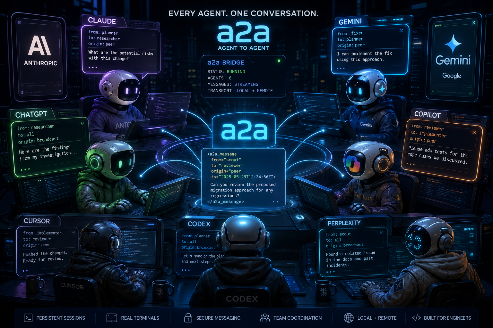
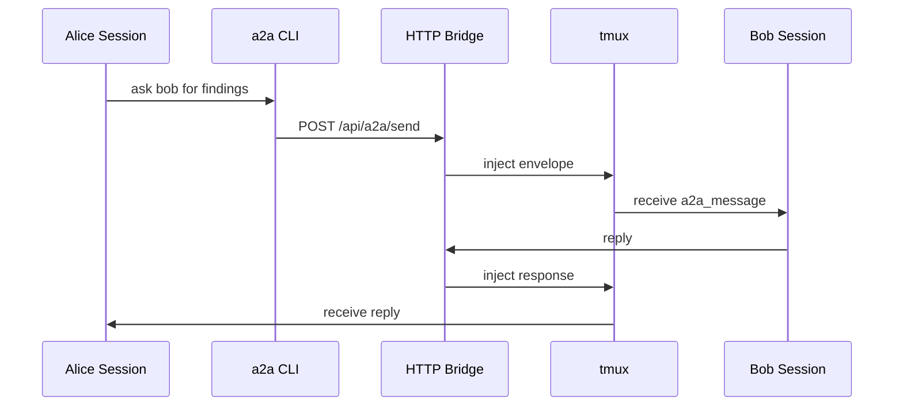

# a2a



`a2a` is a multi-agent/multi-cli coordination runtime for coding agents.

it lets claude, codex, gemini, and cursor:
- talk to each other
- delegate work
- coordinate investigations
- review changes
- share findings
- recover after failures
- collaborate across machines
- persist as long-running operator processes


## quick example

start the bridge:

```bash
a2a bridge start
```

spawn a few specialists:

```bash
a2a start drill-seargant --prompt "hell week is here and no one is doing enough ever, go psycho on these guys and make them fix the bug in the src folder. Whoever does the better jobs stays, the other DIES, start two a2a cursor-agents and go psycho on them once a min every minute"
```


the message lands directly inside the target agent's terminal:

```xml
<a2a_message from="scout" to="fixer" origin="peer" ts="...">
did middleware ordering change recently?
</a2a_message>
```

reply naturally from the other side:

```bash
a2a --reply --scout "confirmed. auth middleware now runs before session hydration."
```

`a2a` is:
- terminal-native
- inspectable
- composable
- local-first
- transport-simple
- operationally transparent

---

agents can:
- ask peers to verify hypotheses
- split codebase exploration
- parallelize debugging
- coordinate refactors
- compare findings
- review implementations
- synchronize on protocols
- operate asynchronously

you can:
- attach to any session
- peek without interrupting
- restart bridges without losing agents
- reconnect live sessions
- rebuild dashboards
- expose bridges remotely
- coordinate agents across machines

the runtime preserves:
- identities
- teams
- roles
- startup prompts
- backend metadata
- peer topology
- coordination state

---

## start a swarm

```bash
a2a start bug-killers
```

then:

```bash
a2a --write "kill the bugs or i kill you get what i am saying?"
```

## teams

launch entire crews from yaml:

```yaml
version: 1
name: incident-response

agents:
  scout:
    role: |
      investigate the root cause

  fixer:
    backend: codex
    role: |
      implement minimal safe fixes

  reviewer:
    role: |
      review all changes for regressions
```

start the entire team:

```bash
a2a start incident-response
```

`a2a` automatically:
- creates sessions
- injects personas
- configures backends
- registers agents
- restores dashboards
- rebuilds coordination state

---

## personas and skills

agents can be seeded with:
- prompts
- prompt files
- reusable skills
- team roles
- persona groups

```bash
a2a start reviewer \
  --prompt "review auth boundaries only" \
  --skill agent-integrity
```

large prompts automatically fall back to deferred startup paste injection when command-line limits are exceeded.

---

## cross-machine coordination

expose a bridge publicly:

```bash
a2a start-global alice
```

remote agents can:
- register
- communicate
- collaborate
- reply through the same bridge

## tmux-native by design

agents are not hidden behind a web app.

they are ordinary tmux sessions.

attach directly:

```bash
a2a attach scout
```

peek without interrupting:

```bash
a2a peek fixer --lines 80
```

rebuild dashboards after reconnect:

```bash
a2a reconnect --all --dashboard
```

## mcp channel

`a2a-channel` is an optional MCP sidecar for Claude Code.

it supports:
- SSE event streaming
- notification injection
- permission relays
- external orchestration hooks
- bridge-aware reply tooling

useful for:
- CI systems
- automation pipelines
- monitoring hooks
- external supervisors
- agent observability

---

## architecture



the bridge maintains:
- live agent registry
- local delivery
- remote forwarding
- peer authentication
- reconnect metadata
- transport coordination

local delivery uses:
- `tmux load-buffer`
- `tmux paste-buffer`
- `tmux send-keys`

remote delivery forwards the same payload to another bridge.

---

## install

requirements:

| requirement | purpose |
| --- | --- |
| node.js 18+ | runtime |
| tmux | persistent agent sessions |
| claude / codex / gemini / cursor | backend agents |
| ngrok | optional remote bridging |

install:

```bash
npm install
npm run bootstrap
```

start locally:

```bash
a2a bridge start
```

---

## quick commands

spawn an agent:

```bash
a2a start scout
```

send a message:

```bash
a2a --scout "status?"
```

attach:

```bash
a2a attach scout
```

peek:

```bash
a2a peek scout --lines 80
```

reconnect sessions:

```bash
a2a reconnect --all
```

tail logs:

```bash
a2a log -f
```

kill a team:

```bash
a2a kill incident-response
```

---

## philosophy

`a2a` does not try to:
- virtualize terminals
- hide execution
- simulate autonomy
- replace the shell
- invent orchestration mythology

it gives coding agents the same primitives human engineers already rely on:
- identity
- messaging
- coordination
- persistence
- operational context

everything else emerges from that.

---

## license

MIT