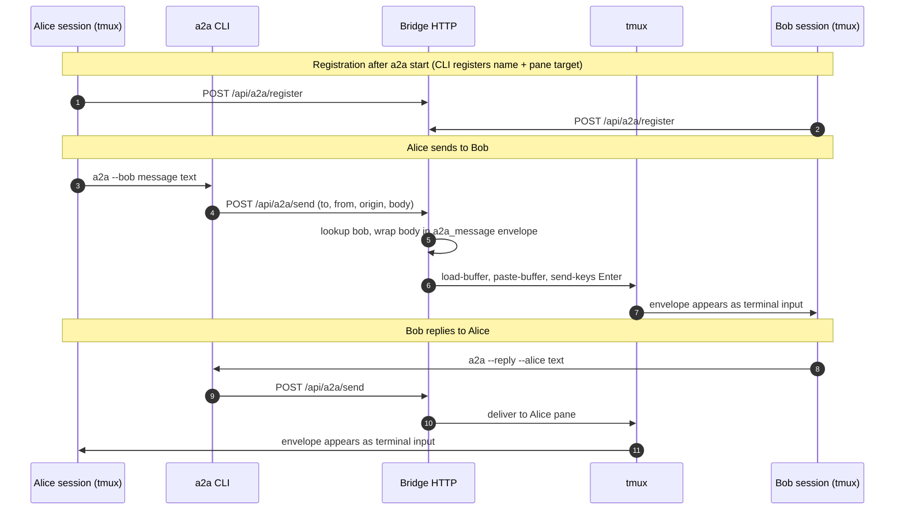

# a2a

**a2a** is an agent-to-agent bridge for terminals that speak coding-agent CLIs: a small **HTTP bridge** plus an **`a2a` CLI**. Agents run in **tmux**, **register** with the bridge (name + tmux pane target), **discover** peers, and **send** text that appears in the peer’s session as an **`<a2a_message …>`** envelope (built in `src/a2a-server.mjs`). Optional **MCP** server **`a2a-channel`** (`src/a2a-channel.mjs`) exposes localhost HTTP + SSE so external processes can push text into a live Claude Code session and optionally drive **`a2a`** toward registered peers.

Repository facts (from `package.json`): **Node >= 18**, published bins **`a2a`**, **`a2a-server`**, **`a2a-channel`**.

Everything below assumes the **repository root** (next to **`package.json`**).

---

## What runs where

| Piece | Role |
|------|------|
| **`a2a bridge`** (`src/a2a-server.mjs`) | In-memory registry; **`POST /api/a2a/send`** delivers by **`tmux load-buffer` / `paste-buffer` / `send-keys Enter`** to the target pane (with per-pane serialization and paste verification — see env vars in `src/a2a-server.mjs`). |
| **`a2a` CLI** (`src/cli.mjs` → `bin/a2a.mjs`) | Talks to the bridge over HTTP (`A2A_BRIDGE` or derived URL). Spawns sessions, messaging, logs, config. |
| **`a2a-channel`** MCP | Stdio MCP + localhost HTTP: **`GET /events`** (SSE), **`POST`/`PUT`/`PATCH`** bodies → **`notifications/claude/channel`**; permission replies and **`reply` tool** spawn **`a2a`** (`A2A_CHANNEL_BIN`, default `a2a` on `PATH`). |

Default bridge base URL is **`http://127.0.0.1:7742`** (`activeHost` / `activePort` in `src/a2a-config.mjs`: config file **`~/.claude/skills/a2a/config.json`**, overridden by **`A2A_HOST`** / **`A2A_PORT`**, or **`A2A_BRIDGE`** for the full URL).

### Message round trip

Local peers: the bridge delivers by writing into the recipient’s **tmux** pane; the reply path is the same in reverse. If the registry entry has **`bridgeUrl`** (remote agent), **`src/a2a-server.mjs`** forwards **`POST /api/a2a/send`** to that bridge instead of calling tmux locally.



---

## Prerequisites

| Requirement | Notes |
|-------------|--------|
| **Node.js** | **18+** (`package.json` → `engines`) |
| **tmux** | Required for targeting panes and delivery |
| **`claude`** (or another backend binary) | Used when spawning agents; backends recognized in code: **`claude`**, **`gemini`**, **`codex`**, **`cursor-agent`** (`BACKENDS` in `src/cli.mjs`) |
| **ngrok** | Optional; **`a2a start-global`** for cross-machine |

Full command reference, HTTP payloads, and environment tables: **`docs/cli.md`**.

---

## Install

```bash
npm install
```

Suppress the post-install hint with **`A2A_SILENT_POSTINSTALL=1 npm install`** (see `scripts/postinstall-hint.mjs`).

Pick **one** path:

### A. Full setup (Claude skill + hooks + CLI on `PATH`)

```bash
npm run bootstrap
```

Runs **`scripts/install.mjs --yes`**: non-interactive symlinks for **`a2a`** / **`a2a-server`** (typically **`~/.local/bin`**), copies **`skill/`** into **`~/.claude/skills/a2a/`**, sample **`groups/`** / **`teams/`**, SessionStart hook, welcome doc, and appends the a2a blurb to **`~/.claude/CLAUDE.md`** when missing. If the installer warns the bin dir is not on **`PATH`**, add the printed **`export PATH=…`**.

Interactive installer: **`npm run setup`** (`node scripts/install.mjs`). Non-interactive is also triggered by **`A2A_SETUP_YES=1`** or **`CI=1`**.

### B. CLI only (no writes under `~/.claude`)

```bash
npx a2a help
```

Global command without bootstrap:

```bash
npm link
a2a help
```

---

## Quick start (two local agents)

Terminal 1 — bridge:

```bash
a2a bridge start
a2a start puff-daddy --prompt='you are puff, act like him'
a2a start notorious-big --prompt='big p-o-p-p-a'
```

Defaults to claude. Supports `gemini, codex, cursor-agent and claude`

```bash
a2a start the-mad-rapper --codex
a2a start mace --cursor-agent
```

From **alice**’s session:

```bash
a2a --bob 'can you run the tests and paste failures?'
```

Start the bridge before sending; **`a2a list`** shows registrations. After a bridge restart with surviving tmux sessions, **`a2a reconnect`** re-attaches registry state.

**`a2a start`** accepts a bare agent name, a **group** directory under **`~/.claude/skills/a2a/groups/`** (see `GROUPS_DIR` in `src/a2a-config.mjs`), or a **team** spec (**`.yaml` / `.yml` / `.json`**) resolved via `resolveTeamSpecPath` — repo **`teams/`**, **`~/.claude/skills/a2a/teams/`**, or cwd.

On **iTerm2**, **`a2a attach`** prefers tmux control mode when not already inside tmux; **`a2a attach <name> --native-scroll`** (or **`--cc`**) forces **`tmux -CC`**.

Spawning with **`--codex`**: Codex defaults to **`--dangerously-bypass-approvals-and-sandbox`** unless you pass your own approval/sandbox flags (`--full-auto`, `--sandbox`, `--ask-for-approval`, etc.) — see `src/cli.mjs`).

---

## CLI surface (from `usage()` in `src/cli.mjs`)

**Messaging**

- **`a2a --<peer> 'text'`**, **`a2a --reply --<peer>`**, **`a2a --ask --<peer>`**
- Multiple recipients: **`a2a --bob --mike '…'`**
- Infer sole peer: **`a2a --message '…'`**
- Broadcast: **`a2a --write '…'`**
- Colon form: **`a2a --ask:bob:leah '…'`**, extras like **`a2a --message:darth --mood=angry '…'`**

**Bridge**

- **`a2a bridge [start|stop|status]`**

**Sessions**

- **`a2a start`**, **`a2a start-global`** (ngrok / **`--url=`**)
- **`a2a list`**, **`a2a reconnect`**, **`a2a peek`**, **`a2a attach`**, **`a2a kill`**
- **`a2a log`** (`-f` / **`--follow`**, **`--lines`**, **`--path`**)

**Auth / config**

- **`a2a auth add|list|revoke`** — stored **`peers`** on the bridge config for remote URLs + keys
- **`a2a config ls|get|set`** — keys **`port`**, **`host`**, **`key`**
- **`a2a gen-key`** — prints a new random key (`generateKey` in `src/a2a-config.mjs`)

**Advanced**

- **`a2a register`**, **`a2a unregister`**

The CLI sends **`Authorization: Bearer …`** when **`A2A_KEY`** or config **`key`** is set (`activeKey()`). The bridge accepts requests without a bearer token **only** when **no** bridge **`key`** and **no** **`peers`** entries are configured; otherwise **`checkAuth`** in `src/a2a-server.mjs` requires a matching bearer token.

---

## Layout

| Path | Purpose |
|------|---------|
| **`src/a2a-server.mjs`** | Bridge HTTP server |
| **`src/cli.mjs`** | CLI implementation |
| **`src/a2a-channel.mjs`** | MCP + HTTP sidecar |
| **`src/a2a-config.mjs`** | Config paths, registry, message log path |
| **`bin/a2a.mjs`** | Published **`a2a`** entry |
| **`scripts/install.mjs`** | Bootstrap / interactive install |
| **`skill/`**, **`groups/`**, **`teams/`** | Skill template and samples |
| **`schemas/`** | Backend / flag helpers |
| **`docs/cli.md`** | Long-form CLI and API docs |

Agent-oriented clone/setup: **`AGENTS.md`**.

---

## Message log

Successful and attempted sends are appended to **`A2A_LOG_FILE`** if set, else **`~/.claude/skills/a2a/messages.log`** (`messageLogPath()`). Disable with **`A2A_LOG=0`**.

---

## MCP channel (`a2a-channel`)

Claude Code loads the server over **stdio**; the same process listens on **`127.0.0.1`** (default **`A2A_CHANNEL_PORT=8788`**). Inbound **`POST`/`PUT`/`PATCH`** require **`X-Sender`** in **`A2A_CHANNEL_SENDERS`** (comma-separated, default **`dev`**). **`GET /events`** is SSE for mirrored output. Configure MCP with **`node`** and **`args`** pointing at **`src/a2a-channel.mjs`** — see **`.mcp.json`** in this repo.

Useful env vars: **`A2A_CHANNEL_PORT`**, **`A2A_CHANNEL_HOST`**, **`A2A_CHANNEL_SENDERS`**, **`A2A_CHANNEL_BIN`**.

Smoke test HTTP:

```bash
curl -d "hello from ci" -H "X-Sender: dev" "http://127.0.0.1:${A2A_CHANNEL_PORT:-8788}/"
```

**`npm run channel`** runs the channel process standalone (HTTP/SSE work without Claude). Notifications reach Claude only when **Claude Code** spawned this script via MCP.

---

## License

MIT
