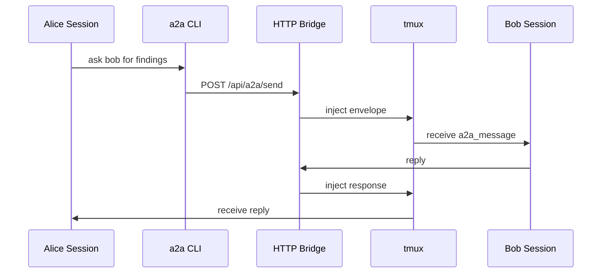

# a2a

> run an engineering organization in tmux.

`a2a` is a local-first multi-agent coordination runtime for coding agents.

it lets claude, codex, gemini, and cursor agents:
- talk to each other
- delegate work
- coordinate investigations
- review changes
- share findings
- recover after failures
- collaborate across machines
- persist as long-running operator processes

all from the terminal.

not simulated agents.
not browser tabs.
not orchestration theater.

real persistent sessions with identities, transport, routing, recovery, and collaboration.

---

## what this actually is

most agent tooling today treats agents like disposable prompts.

`a2a` treats them like operators.

each agent:
- has an identity
- lives inside a real tmux session
- maintains persistent context
- can communicate with peers
- can coordinate asynchronously
- can survive bridge restarts
- can be inspected at any time
- can participate in teams and remote topologies

the result feels less like "chatting with ai"
and more like supervising a distributed engineering team.

---

## quick example

start the bridge:

```bash
a2a bridge start
```

spawn a few specialists:

```bash
a2a start scout --prompt "investigate the auth regression"
a2a start fixer --codex --prompt "implement safe fixes only"
a2a start reviewer --prompt "review every change for regressions"
```

coordinate them:

```bash
a2a --scout "ask fixer whether middleware ordering changed recently"
```

the message lands directly inside the target agent's terminal:

```xml
<a2a_message from="scout" to="fixer" origin="peer" ts="...">
did middleware ordering change recently?
</a2a_message>
```

reply naturally from the other side:

```bash
a2a --reply --scout "confirmed. auth middleware now runs before session hydration."
```

---

## why it feels different

most "multi-agent" systems are:
- centralized
- opaque
- browser-first
- heavily abstracted
- impossible to debug
- fake autonomy wrapped around hidden prompts

`a2a` is:
- terminal-native
- inspectable
- composable
- local-first
- transport-simple
- operationally transparent

agents are just tmux sessions.

the bridge is just a small http server.

messages are structured envelopes pasted directly into terminals.

everything stays visible.

---

## the important part

the interesting thing is not messaging.

the interesting thing is persistent coordination.

agents can:
- ask peers to verify hypotheses
- split codebase exploration
- parallelize debugging
- coordinate refactors
- compare findings
- review implementations
- synchronize on protocols
- operate asynchronously

you can:
- attach to any session
- peek without interrupting
- restart bridges without losing agents
- reconnect live sessions
- rebuild dashboards
- expose bridges remotely
- coordinate agents across machines

the runtime preserves:
- identities
- teams
- roles
- startup prompts
- backend metadata
- peer topology
- coordination state

---

## real runtime behavior

`a2a` is not a toy wrapper around tmux.

the runtime handles:
- per-target delivery locking
- bracketed paste synchronization
- startup paste stabilization
- enter-key retry verification
- reconnect semantics
- bridge recovery
- peer authentication
- remote routing
- operator authorization
- dashboard reconstruction
- backend normalization
- deferred persona injection
- multi-backend orchestration

it was built to survive real agent workflows, not screenshots.

---

## start a swarm

```bash
a2a start researcher
a2a start tester
a2a start planner
a2a start implementer
a2a start reviewer
```

then:

```bash
a2a --planner "coordinate the others and produce a fix plan"
```

or:

```bash
a2a --researcher "ask reviewer whether the migration path is safe"
```

or:

```bash
a2a --implementer --reviewer "sync on the wire format before patching"
```

---

## teams

launch entire crews from yaml:

```yaml
version: 1
name: incident-response

agents:
  scout:
    role: |
      investigate the root cause

  fixer:
    backend: codex
    role: |
      implement minimal safe fixes

  reviewer:
    role: |
      review all changes for regressions
```

start the entire team:

```bash
a2a start incident-response
```

`a2a` automatically:
- creates sessions
- injects personas
- configures backends
- registers agents
- restores dashboards
- rebuilds coordination state

---

## personas and skills

agents can be seeded with:
- prompts
- prompt files
- reusable skills
- team roles
- persona groups

```bash
a2a start reviewer \
  --prompt "review auth boundaries only" \
  --skill agent-integrity
```

large prompts automatically fall back to deferred startup paste injection when command-line limits are exceeded.

---

## cross-machine coordination

expose a bridge publicly:

```bash
a2a start-global alice
```

remote agents can:
- register
- communicate
- collaborate
- reply through the same bridge

same protocol.
same envelopes.
same runtime model.

local and remote agents become indistinguishable from the messaging surface.

---

## tmux-native by design

agents are not hidden behind a web app.

they are ordinary tmux sessions.

attach directly:

```bash
a2a attach scout
```

peek without interrupting:

```bash
a2a peek fixer --lines 80
```

rebuild dashboards after reconnect:

```bash
a2a reconnect --all --dashboard
```

because the runtime is tmux-native:
- sessions survive bridge restarts
- sessions remain inspectable
- orchestration stays debuggable
- everything composes with normal shell tooling

---

## mcp channel

`a2a-channel` is an optional MCP sidecar for Claude Code.

it supports:
- SSE event streaming
- notification injection
- permission relays
- external orchestration hooks
- bridge-aware reply tooling

useful for:
- CI systems
- automation pipelines
- monitoring hooks
- external supervisors
- agent observability

---

## architecture



the bridge maintains:
- live agent registry
- local delivery
- remote forwarding
- peer authentication
- reconnect metadata
- transport coordination

local delivery uses:
- `tmux load-buffer`
- `tmux paste-buffer`
- `tmux send-keys`

remote delivery forwards the same payload to another bridge.

---

## install

requirements:

| requirement | purpose |
| --- | --- |
| node.js 18+ | runtime |
| tmux | persistent agent sessions |
| claude / codex / gemini / cursor | backend agents |
| ngrok | optional remote bridging |

install:

```bash
npm install
npm run bootstrap
```

start locally:

```bash
a2a bridge start
```

---

## quick commands

spawn an agent:

```bash
a2a start scout
```

send a message:

```bash
a2a --scout "status?"
```

attach:

```bash
a2a attach scout
```

peek:

```bash
a2a peek scout --lines 80
```

reconnect sessions:

```bash
a2a reconnect --all
```

tail logs:

```bash
a2a log -f
```

kill a team:

```bash
a2a kill incident-response
```

---

## philosophy

`a2a` does not try to:
- virtualize terminals
- hide execution
- simulate autonomy
- replace the shell
- invent orchestration mythology

it gives coding agents the same primitives human engineers already rely on:
- identity
- messaging
- coordination
- persistence
- operational context

everything else emerges from that.

---

## license

MIT