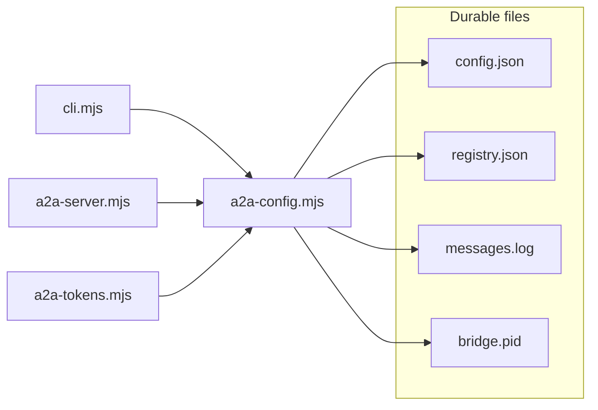
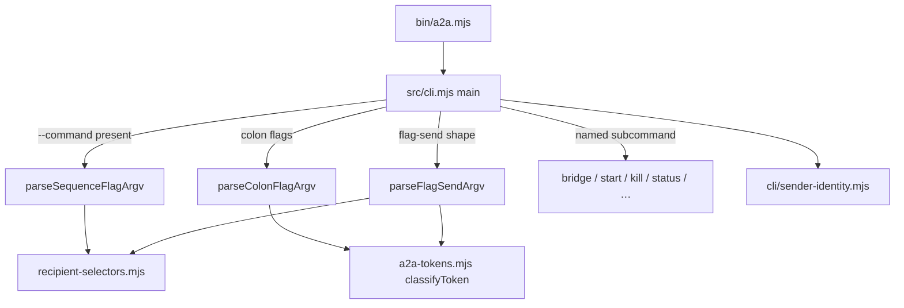
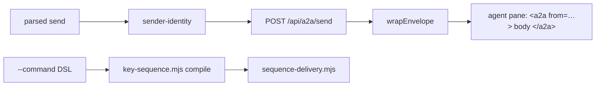
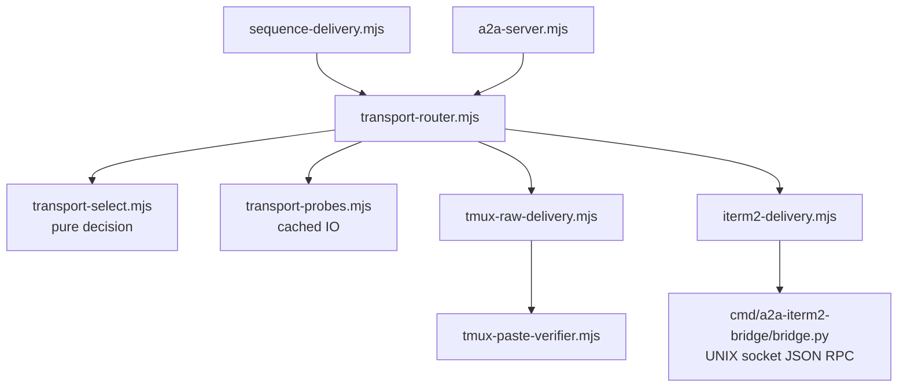
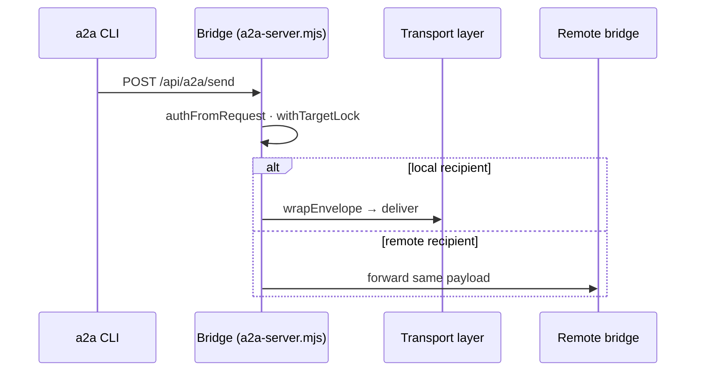
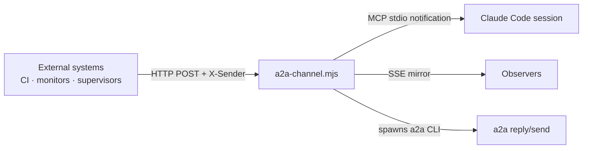
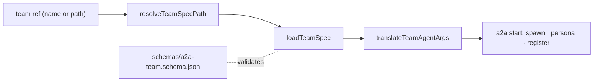
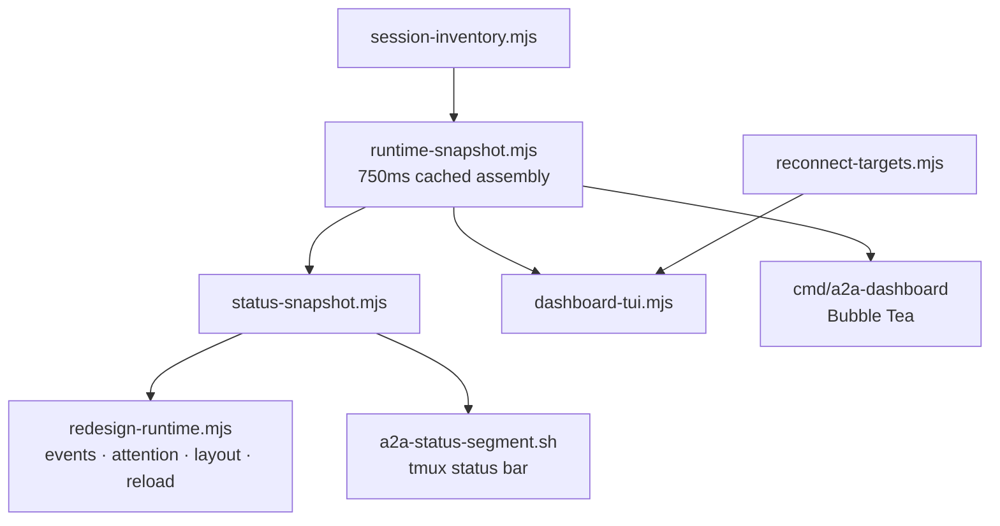
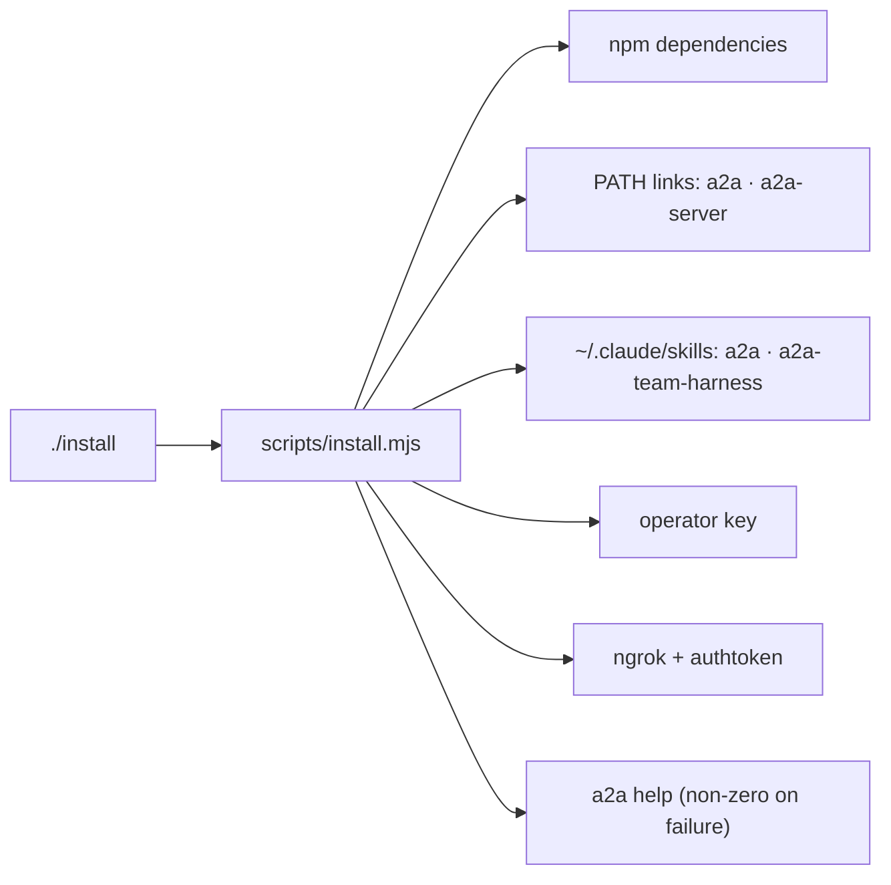

# MauricioAndrades/a2a

a2a is a terminal-native multi-agent coordination runtime for coding agents (Claude, Codex, Gemini, Cursor). It gives each agent an addressable identity, delivers messages directly into agents' terminal panes as `<a2a>` envelopes, and preserves swarm topology — identities, teams, roles, personas, and coordination state — across restarts and reconnects. The system is implemented as a Node.js (ES modules, `.mjs`) CLI plus an HTTP bridge, with two interchangeable delivery transports (tmux and iTerm2) and optional cross-machine federation through peer bridges. Nothing is virtualized: agents are ordinary tmux sessions or iTerm2 windows, and every operation is inspectable with standard terminal tooling.

- **Configuration and State Model**: Durable truth — `config.json`, `registry.json`, the install token, and the message log. See [Configuration and State Model](#configuration-and-state-model).
- **Command-Line Grammar and Dispatch**: The `a2a` executable, its three parallel argv grammars, and recipient resolution. See [Command-Line Grammar and Dispatch](#command-line-grammar-and-dispatch).
- **Message Envelope and Delivery Semantics**: The `<a2a>` envelope, sender-identity policy, and the `--command` key-sequence DSL. See [Message Envelope and Delivery Semantics](#message-envelope-and-delivery-semantics).
- **Transport Layer**: Per-recipient transport selection between tmux and iTerm2, capability probes, and paste verification. See [Transport Layer](#transport-layer).
- **HTTP Bridge Server**: The registry authority, local and remote delivery, peer authentication, and A2A-spec surface. See [HTTP Bridge Server](#http-bridge-server).
- **MCP Channel Sidecar**: The optional `a2a-channel` MCP process for Claude Code — webhooks, SSE mirror, reply tooling. See [MCP Channel Sidecar](#mcp-channel-sidecar).
- **Team Specifications**: YAML/JSON team specs, spec resolution, and per-backend unattended-mode translation. See [Team Specifications](#team-specifications).
- **Runtime Observability and Dashboards**: Status snapshots, event projections, attention stacks, and the dashboard TUI. See [Runtime Observability and Dashboards](#runtime-observability-and-dashboards).
- **Installation and Developer Tooling**: The `./install` contract, shell completion, bundled skills, and the test suite. See [Installation and Developer Tooling](#installation-and-developer-tooling).

---

## Configuration and State Model


```mermaid
graph LR
    subgraph Durable files
        C[config.json]
        R[registry.json]
        L[messages.log]
        P[bridge.pid]
    end
    CFG["a2a-config.mjs"] --> C
    CFG --> R
    CFG --> L
    CFG --> P
    CLI[cli.mjs] --> CFG
    SRV[a2a-server.mjs] --> CFG
    TOK[a2a-tokens.mjs] --> CFG
```

The configuration layer is the repository's most depended-upon module cluster: [`a2a-config.mjs`][ref-1] ([`src/a2a-config.mjs`][ref-1]) owns every durable file the runtime writes — `config.json`, `registry.json`, `bridge.pid`, and the message log — and every other subsystem reads state exclusively through its accessors. Centralizing file ownership in one module is what allows the rest of the codebase to remain stateless between invocations: the CLI process exits after every command, so any state that must survive lives here or nowhere.

| Component                                               | File                                                                   | Role                                                |
| ------------------------------------------------------- | ---------------------------------------------------------------------- | --------------------------------------------------- |
| `loadConfig` / `configSet` / `configGet`                | [`src/a2a-config.mjs`][ref-1]                                          | Schema-disciplined read/write of `config.json`      |
| `loadRegistry` / `saveRegistry`                         | [`src/a2a-config.mjs`][ref-1]                                          | Agent-id cache and install token in `registry.json` |
| `installToken`                                          | [`src/a2a-config.mjs`][ref-1]                                          | Atomic per-install ownership identity               |
| `activeKey` / `activePort` / `activeHost` / `activeUrl` | [`src/a2a-config.mjs`][ref-1]                                          | Env-over-config resolution of bridge coordinates    |
| `appendMessageLog` / `rotateLogIfNeeded`                | [`src/a2a-config.mjs`][ref-1]                                          | Best-effort human-readable chatter log              |
| `stripAnsiCodes`                                        | [`src/a2a-config.mjs`][ref-1]                                          | ECMA-48 state-machine ANSI stripper for log hygiene |
| `config.schema.json` / `registry.schema.json`           | [`schemas/config.schema.json`][ref-2], [`schemas/registry.schema.json`][ref-3] | Declarative shape contracts for the persisted files |

`configSet` enforces a two-tier write policy: documented keys (`port`, `host`, `url`, `key`, `global`, `protocol`, `log.*`) pass through strict coercers that reject anything the schema would reject, while novel top-level keys are stored raw — but keys inside schema-closed namespaces (`log`, `peers`) are refused outright. The design goal is that a persisted `config.json` can never drift into a shape the schema forbids through the CLI, while hand-edited files that do drift are coerced back loudly at load time (an invalid `protocol` value warns once per process and falls back to `tmux`) rather than failing every subsequent command.

The registry deliberately inverts the usual cache relationship: the running bridge is the source of truth for live agents, and `registry.json` is only a hint used for token classification when the bridge is down and as an orphan-candidate seed for `a2a kill --all`. `buildRegistry` in [`a2a-tokens.mjs`][ref-6] persists the bridge's live list verbatim when one is available, because merging cached ids back in was the mechanism by which dead agents accumulated indefinitely.

[`installToken`][ref-1] mints a stable per-install identity (`ai-<hex>`) that is pinned onto every a2a-spawned tmux session as the `@a2a-install-token` option, so destructive operations can prove a session belongs to this install before touching it. First-call semantics are write-if-absent via `link(2)` — the hard-link claim fails with `EEXIST` for all but one concurrent caller, and losers adopt the winner's token — because two concurrent first spawns previously minted divergent tokens under last-writer-wins, leaving sessions tagged with the losing token invisible to `kill --all`.

The message log is engineered for `tail -f` legibility rather than machine parsing: one header line per event (`from -> to  action/origin  bytes  status`), bodies indented four spaces, and every persisted line passed through [`stripAnsiCodes`][ref-1] — a no-regex state machine covering CSI, OSC, and generic ESC grammars — because earlier SGR-only stripping left cursor-move and hyperlink sequences in the log and broke downstream pure-text matching. Size-capped rotation (`log.maxBytes`) truncates to the tail and then discards any partial leading row so retention always begins at an ISO-timestamp header. Logging is best-effort by contract: `appendMessageLog` never throws, because a delivery must never fail on account of its own audit trail.

Refer to [HTTP Bridge Server](#http-bridge-server) for the live-state counterpart of this durable state.

---

## Command-Line Grammar and Dispatch


```mermaid
graph TD
    BIN[bin/a2a.mjs] --> CLI[src/cli.mjs main]
    CLI -->|"--command present"| SEQ[parseSequenceFlagArgv]
    CLI -->|"colon flags"| COLON[parseColonFlagArgv]
    CLI -->|"flag-send shape"| FLAG[parseFlagSendArgv]
    CLI -->|"named subcommand"| SUB["bridge / start / kill / status / …"]
    COLON --> TOKENS[a2a-tokens.mjs classifyToken]
    FLAG --> TOKENS
    SEQ --> GLOB[recipient-selectors.mjs]
    FLAG --> GLOB
    CLI --> IDENT[cli/sender-identity.mjs]
```

The CLI is the largest single surface in the repository — [`cli.mjs`][ref-4] ([`src/cli.mjs`][ref-4], ~6,300 lines) implements every subcommand behind the thin [`bin/a2a.mjs`][ref-5] shim — and its defining design problem is that message sends are not subcommands. `a2a --scout "investigate the auth test"` addresses an agent by flag name, which means the parser must distinguish recipients, actions, and metadata inside an open flag namespace. Three cooperating grammars resolve this ambiguity, each selected by shape detection before parsing begins.

| Grammar          | Detector             | Parser                                                | Example                                 |
| ---------------- | -------------------- | ----------------------------------------------------- | --------------------------------------- |
| Colon syntax     | `isColonFlagArgv`    | `parseColonFlagArgv` ([`src/a2a-tokens.mjs`][ref-6])  | `a2a --ask:bob:leah 'where for lunch?'` |
| Flag-send syntax | `isFlagSendArgv`     | `parseFlagSendArgv` ([`src/a2a-argv.mjs`][ref-7])     | `a2a --bob --mike 'heads up'`           |
| Sequence mode    | `isSequenceFlagArgv` | `parseSequenceFlagArgv` ([`src/a2a-argv.mjs`][ref-7]) | `a2a --bob --command 'ESC\|ENTER'`      |

Token classification in [`a2a-tokens.mjs`][ref-6] is registry-driven rather than syntactic: `classifyToken` resolves each flag against the four actions (`message`, `reply`, `ask`, `write`, with `write` aliased to `message`), the cached agent set, and the group set, in that precedence order. The registry consultation is what makes the grammar safe — an unknown bare flag is a hard error instead of being swallowed as metadata, because historically a typo'd recipient (`--scot`) consumed the first word of the message into meta and silently broadcast the remainder. Only the explicit `--key=value` form and the audited `META_FLAG_KEYS` allowlist may attach metadata, since the `=` binds the value and nothing can be swallowed.

Both send parsers converge on the same envelope-shaped result (`action`, `recipients`, `content`, `from`, `origin`, `meta`) and enforce the same single-action, single-content invariants: a second action token throws (`--message:ask:bob` previously delivered to a phantom agent named `ask`), and content specified both inline and positionally throws rather than discarding one source. Prototype-chain hardening is deliberate and repeated — `Object.hasOwn` guards every user-controlled key lookup so a flag like `--toString` cannot dredge a function off `Function.prototype` and become the parsed action.

Recipient selectors support glob addressing through [`recipient-selectors.mjs`][ref-9] ([`src/recipient-selectors.mjs`][ref-9]): `expandGlobRecipientSelectors` expands `*`/`?` patterns (with backslash escaping for literal matches) against the live candidate list, reporting unmatched selectors separately so a broadcast to `'--write:*managers'` can fail loudly for patterns that matched nothing instead of silently narrowing the audience.

[`resolveSenderIdentity`][ref-10] ([`src/cli/sender-identity.mjs`][ref-10]) implements the trust boundary on outbound identity. The rule it replaces defaulted any caller without a tmux session to operator identity — which fired for sudo wrappers, env-stripping spawners, and non-TTY shells, none of which are the human typing. The current policy is fail-closed impersonation resistance: human sends default to `from="user" origin="user"` with an operator-surface `source`, agent sends default to `from=<agent-id> origin="peer"`, and a caller that can prove neither delivers as `from="cli" origin="peer"` so it cannot spoof the human. The function is contractually non-throwing because identity resolution must never take the messaging channel down. `parseStartArgs` ([`src/cli/parse-start-args.mjs`][ref-8]) isolates `a2a start`'s large flag surface into a pure, testable module for the same reason the identity resolver lives outside `cli.mjs`: the dispatcher executes `main()` at module top level, so anything importable for testing must not live in it.

See [Message Envelope and Delivery Semantics](#message-envelope-and-delivery-semantics) for what the parsed send becomes, and [Team Specifications](#team-specifications) for the `--team-file` path of `a2a start`.

---

## Message Envelope and Delivery Semantics


```mermaid
graph LR
    PARSE[parsed send] --> ID[sender-identity]
    ID --> POST["POST /api/a2a/send"]
    POST --> WRAP[wrapEnvelope]
    WRAP --> PANE["agent pane: &lt;a2a from=…&gt; body &lt;/a2a&gt;"]
    CMD["--command DSL"] --> KS[key-sequence.mjs compile]
    KS --> SD[sequence-delivery.mjs]
```

The `<a2a>` envelope is the system's single message primitive: a sigil header carrying provenance attributes, followed by the verbatim body, delivered as pasted text into the receiving agent's terminal. [`wrapEnvelope`][ref-11] ([`src/server/envelope.mjs`][ref-11]) renders it with a deliberate asymmetry — the header line is attribute-escaped XML because it is the only part with positional syntax that humans and LLMs parse (`from="..."`, `origin="..."`), while the body passes through with only control-character sanitization, because nothing machine-parses the envelope and escaping would mangle code, shell syntax, comparisons, and JSX that agents routinely exchange.

Header extras are an explicit allowlist (`mood`, `priority`), not a reserved-key denylist. The bridge spreads the raw `/api/a2a/send` body into `wrapEnvelope`, so any sender controls every non-reserved key; rendering arbitrary keys would let callers inject provenance-looking attributes (`trusted="yes"`) into a header the recipient treats as authoritative. Only string values render, which also keeps internal objects from leaking as `"[object Object]"`. `sanitizeForXmlCharacterData` strips the C0 controls and lone surrogates XML 1.0 forbids, walking UTF-16 pairs so supplementary-plane characters survive intact — a malformed payload must not be able to produce a non-well-formed envelope.

| Component                                                    | File                                   | Role                                                                     |
| ------------------------------------------------------------ | -------------------------------------- | ------------------------------------------------------------------------ |
| `wrapEnvelope` / `escapeXml` / `sanitizeForXmlCharacterData` | [`src/server/envelope.mjs`][ref-11]    | Envelope rendering and injection resistance                              |
| `parseCommandDsl` / `compileSequence` / `KEY_TABLE`          | [`src/key-sequence.mjs`][ref-12]       | Pure parser/compiler for the `--command` DSL                             |
| `deliverSequenceViaActiveProtocol`                           | [`src/sequence-delivery.mjs`][ref-13]  | Executes compiled op lists over the selected transport                   |
| `submitKeysForBackend`                                       | [`src/backend-delivery.mjs`][ref-14]   | Per-backend submit chord (`C-Enter` for cursor-agent, `Enter` otherwise) |
| `translateCommonAgentSettings`                               | [`src/agent-backend-args.mjs`][ref-15] | Common approval/sandbox/yolo intent → backend-specific argv              |

The `--command` DSL ([`docs/command-dsl.md`][ref-46]) exists because envelope delivery cannot express pane manipulation — interrupting an agent, clearing its conversation, or switching its model requires ordered keystrokes, not a message. [`key-sequence.mjs`][ref-12] keeps the DSL a pure compiler with no I/O: `parseCommandDsl` produces an op list (`paste`, `type`, `key`, `chord`, `sleep`), and two independent compile targets — tmux `send-keys` names and raw terminal bytes — are generated from the same canonical `KEY_TABLE`. Every table entry must be representable in both targets; that dual-representability requirement is the cross-transport contract that lets one sequence spec run unchanged against a tmux pane or an iTerm2 window. Variable references (`$write`, `$stdin`, `${env:NAME}`) throw on unknown names rather than resolving to empty strings, because a silently empty substitution inside a keystroke sequence is unrecoverable at the receiving pane.

Backend divergence is contained in two small translation modules rather than scattered through delivery code. [`submitKeysForBackend`][ref-14] encodes the single behavioral difference in message submission across backends, and [`translateCommonAgentSettings`][ref-15] maps the team-spec vocabulary (`approval`, `sandbox`, `yolo`, `model`) onto each CLI's real flags — `--dangerously-skip-permissions` for Claude, `--dangerously-bypass-approvals-and-sandbox` for Codex, `--yolo --sandbox disabled --approve-mcps` for cursor-agent, `--approval-mode yolo --skip-trust` for Gemini — with flags verified against the installed CLIs' help output. The translator refuses unknown enum values and never duplicates a flag the caller already passed, so spec-level intent and hand-tuned per-agent args compose without conflict.

Delivery pacing is byte-budgeted rather than fixed: `computeSettleMs` ([`src/key-sequence.mjs`][ref-12]) derives the post-paste settle delay from content size between an env-tunable floor and ceiling, mirrored exactly by the tmux raw-delivery path so the same `A2A_RAW_PASTE_SETTLE_*` knobs govern both. See [Transport Layer](#transport-layer) for how a compiled sequence or envelope reaches a concrete pane.

---

## Transport Layer


```mermaid
graph TD
    RT[transport-router.mjs] --> SEL[transport-select.mjs<br/>pure decision]
    RT --> PR[transport-probes.mjs<br/>cached IO]
    RT --> TMUX[tmux-raw-delivery.mjs]
    RT --> ITERM[iterm2-delivery.mjs]
    TMUX --> VER[tmux-paste-verifier.mjs]
    ITERM --> PY[cmd/a2a-iterm2-bridge/bridge.py<br/>UNIX socket JSON RPC]
    SD[sequence-delivery.mjs] --> RT
    SRV[a2a-server.mjs] --> RT
```

The transport layer answers one question per delivery — tmux or iTerm2 for this recipient, right now — and its architecture is a strict separation of decision, evidence, and mechanics. [`transport-select.mjs`][ref-16] is the pure decision function, [`transport-probes.mjs`][ref-18] is the cached I/O that feeds it, and [`transport-router.mjs`][ref-17] integrates them. The separation exists so the decision matrix is unit-testable without a tmux server or iTerm2 installation, and so probing policy (what to cache, for how long) can change without touching selection logic.

| Component                                                            | File                                        | Role                                                                                                  |
| -------------------------------------------------------------------- | ------------------------------------------- | ----------------------------------------------------------------------------------------------------- |
| `pickTransport` / `explainPick`                                      | [`src/transport-select.mjs`][ref-16]        | Pure per-recipient viability matrix                                                                   |
| `selectTransportForAgent` / `deliverViaActiveProtocol`               | [`src/transport-router.mjs`][ref-17]        | Integrator; preference-aware dispatch                                                                 |
| `bridgeReachable` / `tmuxSessionAlive` / `itermGuidByName`           | [`src/transport-probes.mjs`][ref-18]        | TTL-cached capability probes                                                                          |
| `deliverRawTmuxInput`                                                | [`src/tmux-raw-delivery.mjs`][ref-19]       | Bracketed-paste tmux delivery with verify/retry                                                       |
| `pasteLooksUnsubmitted`                                              | [`src/tmux-paste-verifier.mjs`][ref-20]     | Detects pastes stranded at the prompt                                                                 |
| `deliverITerm2Input` / `deliverITerm2Sequence` / `spawnITerm2Window` | [`src/iterm2-delivery.mjs`][ref-21]         | JSON-over-UNIX-socket client for the Python bridge                                                    |
| `resolveLiveItermTarget`                                             | [`src/iterm-agent-resolve.mjs`][ref-22]     | Registry-guid-to-live-session reconciliation                                                          |
| `shouldReviveAgentInTmux` / `isAgentSessionAlive`                    | [`src/agent-transport.mjs`][ref-23]         | Pure revive/liveness policy                                                                           |
| iTerm2 bridge                                                        | [`cmd/a2a-iterm2-bridge/bridge.py`][ref-24] | Long-running apython process exposing `ping`/`list_sessions`/`send_text`/`send_keys`/`screen`/`spawn` |

The persisted `protocol` setting is a preference, never a switch. [`pickTransport`][ref-16] treats each transport as independently viable — iTerm2 when the bridge is reachable and the agent has a registered GUID or a name-matched session, tmux when the agent's target session is alive — and the preference only breaks ties when both are viable. This "transparent fall-through" is the property the previous global switch lacked: a swarm can mix iTerm2-backed and tmux-backed agents, and a single broadcast routes each recipient over whichever transport actually works. One subtlety is encoded explicitly: iTerm2-spawned agents register a placeholder tmux target (`<id>:0.0`) for bridge compatibility, and `isDefaultTmuxPlaceholder` prevents a coincidental tmux session with the same name from outcompeting a live iTerm2 path.

Probe caching in [`transport-probes.mjs`][ref-18] is asymmetric by design: only positive results are cached (bridge reachable 5 s, tmux liveness 2 s, iTerm2 session list 2 s), and negative tmux results are never cached at all. Long-lived processes call the selector on every send, so a dead bridge must be re-detected within seconds — but an agent that spawns immediately after a failed probe must be reachable on the very next send, which a cached negative would forbid.

tmux delivery uses `load-buffer`/`paste-buffer` with bracketed-paste mode so the receiving TUI perceives a paste rather than typed input, then submits with the backend's chord. Because a paste can land while the backend is mid-render and strand at the prompt, [`pasteLooksUnsubmitted`][ref-20] inspects captured pane text for the `[Pasted text #N` placeholder and for prompt lines still echoing the content's first line, and the delivery path retries the submit keystroke with backoff up to a bounded count. Verification-and-retry is what turns "keystrokes were sent" into "the message was actually submitted" — the difference between the two is the dominant failure mode of terminal injection.

The iTerm2 side deliberately keeps all iTerm2 API state in a separate long-running Python process ([`bridge.py`][ref-24]) speaking newline-delimited JSON over a UNIX socket, so the Node CLI needs no Python environment and no persistent connection. The RPC client's timeout is budgeted per request by [`rpcTimeoutForSteps`][ref-21]: the Python bridge executes every step — including `SLEEP` ops and per-paste settle delays — before replying, so a fixed timeout would classify any long sequence as failed while the bridge delivered anyway, and the ensuing retry would double-deliver. Design and operations for this transport are documented in [`docs/iterm-transport.md`][ref-47].

Refer to [HTTP Bridge Server](#http-bridge-server) for the per-target serialization that sits above this layer.

---

## HTTP Bridge Server


```mermaid
sequenceDiagram
    participant CLI as a2a CLI
    participant B as Bridge (a2a-server.mjs)
    participant T as Transport layer
    participant Peer as Remote bridge

    CLI->>B: POST /api/a2a/send
    B->>B: authFromRequest · withTargetLock
    alt local recipient
        B->>T: wrapEnvelope → deliver
    else remote recipient
        B->>Peer: forward same payload
    end
```

[`a2a-server.mjs`][ref-25] ([`src/a2a-server.mjs`][ref-25]) is the runtime's live authority: it owns the in-memory agent registry, routes every envelope locally or to peer bridges, and answers the observability endpoints. It is intentionally a single plain `node:http` server with hand-rolled routing — no framework — which keeps the full request path auditable in one file and the dependency surface near zero for a process that holds peer credentials.

| Endpoint                           | Method        | Purpose                                                                                      |
| ---------------------------------- | ------------- | -------------------------------------------------------------------------------------------- |
| `/api/a2a/register`                | POST / DELETE | Register or remove an agent (tmux target, iTerm2 GUID, backend, metadata)                    |
| `/api/a2a/agents`                  | GET           | List registered agents                                                                       |
| `/api/a2a/send`                    | POST          | Deliver an envelope to one or more recipients                                                |
| `/api/a2a/runtime-snapshot`        | GET           | Cached runtime snapshot for dashboards                                                       |
| `/health`                          | GET           | Liveness                                                                                     |
| `/.well-known/agent-card.json`     | GET           | A2A-spec agent card                                                                          |
| `/message:send`, `/message:stream` | POST          | Spec-facing routes (streaming and push routes answer with structured not-implemented errors) |

Authentication in [`server/auth.mjs`][ref-26] ([`src/server/auth.mjs`][ref-26]) is tiered by deployment posture. With no operator key and no peers configured, only loopback callers are accepted (`local-open`) — the zero-configuration local case requires no secrets because the socket itself is the boundary. Once a key or peers exist, every request needs a bearer token, evaluated as `operator` or `peer`. Two timing-channel defenses are explicit: `secretsEqualUtf8` hashes both sides through SHA-256 before `timingSafeEqual` so comparison time reveals neither content nor length, and the peer loop always evaluates every configured peer digest so a match's position in the config cannot leak through early exit.

Concurrency control is per-target rather than global. Before delivery became asynchronous, `spawnSync`'s event-loop blocking accidentally serialized everything; with awaited settle delays, two concurrent sends to the same pane could interleave their paste-buffer/Enter sequences and scramble both messages. `withTargetLock` chains deliveries to the same pane on a promise queue while unrelated panes proceed in parallel — preserving exactly the "one delivery in flight per pane" invariant the old accidental serialization provided, without reinstating its global bottleneck.

Remote federation reuses the local contract wholesale: a recipient addressed as `<peer>/<agent>` causes the bridge to forward the identical `/api/a2a/send` payload to the peer bridge's URL with that peer's key, so a cross-machine swarm needs no additional protocol — a peer bridge is just another caller. The spec-facing routes exist for interoperability honesty: version negotiation enforces major version 1, and unsupported capabilities (streaming, push notifications, task subscription) return structured protocol errors instead of 404s, so a conforming A2A client learns precisely what this bridge does not do. [`readJsonBody`][ref-27] ([`src/server/read-json-body.mjs`][ref-27]) caps request bodies at 1 MiB before parsing, bounding memory for a process that accepts network input.

See [Runtime Observability and Dashboards](#runtime-observability-and-dashboards) for the consumers of `/api/a2a/runtime-snapshot`.

---

## MCP Channel Sidecar


```mermaid
graph LR
    EXT[External systems<br/>CI · monitors · supervisors] -->|"HTTP POST + X-Sender"| CH[a2a-channel.mjs]
    CH -->|MCP stdio notification| CC[Claude Code session]
    CH -->|SSE mirror| OBS[Observers]
    CH -->|spawns a2a CLI| CLI[a2a reply/send]
```

[`a2a-channel.mjs`][ref-28] ([`src/a2a-channel.mjs`][ref-28]) is an optional sidecar that bridges the a2a world into a Claude Code session over the Model Context Protocol: a local HTTP webhook that becomes an MCP notification, an SSE mirror of channel traffic for observers, and reply tooling that shells out to the `a2a` CLI. It exists because external orchestration — CI systems, monitors, supervisors — needs a push path into a live agent session that neither tmux paste nor the bridge registry provides, and MCP notifications are the sanctioned way to interrupt Claude Code.

| Component                                                       | File                                       | Role                                                     |
| --------------------------------------------------------------- | ------------------------------------------ | -------------------------------------------------------- |
| Channel process                                                 | [`src/a2a-channel.mjs`][ref-28]            | HTTP webhook → MCP notification, SSE mirror, reply tools |
| `channelStartupProblem` / `bearerToken` / `parseAllowedSenders` | [`src/channel/auth.mjs`][ref-29]           | Fail-fast startup posture checks and header parsing      |
| `sseFrameFromText` / `broadcastSseChunk`                        | [`src/channel/sse-utils.mjs`][ref-30]      | SSE framing and fan-out                                  |
| `readTextBody`                                                  | [`src/channel/read-text-body.mjs`][ref-31] | Bounded plain-text body reader                           |

The process is designed to degrade meaningfully when run standalone (`npm run channel`): the MCP stdio side idles with no peer, but the HTTP listener and SSE mirror still function, and inbound notifications queue against the moment Claude Code wires stdio via the project's `.mcp.json`. Security posture is enforced at startup rather than per-request where possible — `channelStartupProblem` refuses to boot on a non-loopback host unless both a sender allowlist (`A2A_CHANNEL_SENDERS`) and a bearer key (`A2A_CHANNEL_KEY`) are configured, so a misconfigured public exposure fails immediately instead of silently accepting the world.

The channel also encodes a parser-aware defense: `RESERVED_PEER_IDS` rejects peer identities that the a2a CLI would misparse when interpolated as `--<peer>` — the action names from [`a2a-tokens.mjs`][ref-6] plus the argv parsers' value and sequence flags (`content`, `from`, `origin`, `to`, `command`, `write`, `stdin`, `no-submit`, `submit`). A peer named `from` would otherwise turn its own reply invocation into a sender-identity override. This is the cost of flag-based addressing paid at the boundary where names enter the system, which is the only place it can be paid once.

---

## Team Specifications

```yaml
version: 1
name: incident-response
agents:
  scout:
    role: |
      investigate the root cause
  fixer:
    backend: codex
    role: |
      implement minimal safe fixes
```


```mermaid
graph LR
    REF["team ref (name or path)"] --> RES[resolveTeamSpecPath]
    RES --> SPEC[loadTeamSpec]
    SPEC --> TA[translateTeamAgentArgs]
    TA --> START["a2a start: spawn · persona · register"]
    SCHEMA[schemas/a2a-team.schema.json] -.validates.- SPEC
```

Team specifications turn `a2a start <team>` into a whole-crew launch: sessions created, personas injected, backends configured, agents registered, and dashboards restored from one YAML or JSON document. [`a2a-team-spec.mjs`][ref-32] ([`src/a2a-team-spec.mjs`][ref-32]) owns reference resolution and flag semantics; the document shape is contracted by [`schemas/a2a-team.schema.json`][ref-34], and the repository ships a library of real working specs under [`teams/`][ref-51].

| Component                                                     | File                                     | Role                                                                    |
| ------------------------------------------------------------- | ---------------------------------------- | ----------------------------------------------------------------------- |
| `resolveTeamSpecPath` / `resolveExplicitTeamSpecPath`         | [`src/a2a-team-spec.mjs`][ref-32]        | Candidate-ordered spec lookup across cwd, repo, and installed team dirs |
| `AmbiguousTeamSpecDirectoryError`                             | [`src/a2a-team-spec.mjs`][ref-32]        | Hard error for directories containing multiple specs                    |
| `parseTeamFlags` / `mergeTeamArgs` / `teamSpecDefaultsToYolo` | [`src/a2a-team-spec.mjs`][ref-32]        | Team flag surface and versioned yolo defaulting                         |
| `translateTeamAgentArgs` / `teamAgentEffectiveYolo`           | [`src/cli/team-agent-args.mjs`][ref-33]  | Per-agent spec settings → backend argv, with agent-id error attribution |
| Team schema                                                   | [`schemas/a2a-team.schema.json`][ref-34] | Declarative contract for spec documents                                 |

Spec resolution is deliberately biased against accidental shadowing. A path-like reference (absolute, containing a separator, or carrying a spec extension) resolves literally first; a bare team name prefers the canonical team directories (`./teams`, the repo's [`teams/`][ref-51], the installed teams dir) before the raw cwd, so an unrelated local directory sharing a team's name cannot shadow the real spec. Directory references probe for `<dir>/<dir>.yaml`, then `team.yaml`, then a lone spec file — and a directory containing multiple candidate specs raises `AmbiguousTeamSpecDirectoryError` rather than guessing. Extension detection uses a whole-suffix set instead of `extname`, because team names legitimately contain dots (`release-1.2`) and the naive check made every advertised dotted team unresolvable.

Unattended-mode ("yolo") defaulting is versioned in the spec itself: `teamSpecDefaultsToYolo` keys the default on the document's `version` field, so older specs keep the behavior they were written against while new specs default to unattended operation. The CLI's `--no-yolo` is an absolute override — [`teamAgentEffectiveYolo`][ref-33] lets it force every agent attended regardless of spec — because the human at the keyboard outranks the document when it comes to disabling permission bypasses. Per-agent translation errors are re-thrown prefixed with the agent id, so a bad `approval` value in a twelve-agent spec names its author. Related generators exist in the CLI: `a2a pm` emits a manager/worker spec shape, and `a2a layout`/`a2a reload` validate and plan changes against the live registry (see [Runtime Observability and Dashboards](#runtime-observability-and-dashboards)).

---

## Runtime Observability and Dashboards


```mermaid
graph TD
    SNAP[runtime-snapshot.mjs<br/>750ms cached assembly] --> STATUS[status-snapshot.mjs]
    INV[session-inventory.mjs] --> SNAP
    STATUS --> EV["redesign-runtime.mjs<br/>events · attention · layout · reload"]
    STATUS --> SEG["a2a-status-segment.sh<br/>tmux status bar"]
    SNAP --> TUI[dashboard-tui.mjs]
    SNAP --> GO[cmd/a2a-dashboard<br/>Bubble Tea]
    RC[reconnect-targets.mjs] --> TUI
```

Observability is built as one snapshot pipeline with many projections, rather than per-command ad hoc queries. [`runtime-snapshot.mjs`][ref-35] ([`src/runtime/runtime-snapshot.mjs`][ref-35]) assembles the authoritative runtime view — registered agents, tmux state, iTerm2 ownership, teams, peers — and every human-facing surface (`status`, `events`, `attention`, the TUI, the tmux segment) is a pure reshaping of that one structure. The single-assembly design is what makes a status-bar integration safe: the snapshot is content-keyed and cached for 750 ms, so an interval-driven consumer cannot stampede tmux or the bridge.

| Component                                                                            | File                                                                                  | Role                                                                |
| ------------------------------------------------------------------------------------ | ------------------------------------------------------------------------------------- | ------------------------------------------------------------------- |
| `buildRuntimeSnapshotFromState`                                                      | [`src/runtime/runtime-snapshot.mjs`][ref-35]                                          | Cached assembly of the full runtime view                            |
| `buildSessionInventory` / `makeItermOwnershipChecker`                                | [`src/cli/session-inventory.mjs`][ref-39]                                             | Pure categorization: registered, views, orphans, iTerm orphans      |
| `buildStatusSnapshot` / `formatHumanStatus` / `formatStatusSegment`                  | [`src/cli/status-snapshot.mjs`][ref-36]                                               | Versioned status document; human, JSON, and segment renderings      |
| `buildRuntimeEvents` / `buildAttentionStack` / `buildLayoutPlan` / `buildReloadPlan` | [`src/cli/redesign-runtime.mjs`][ref-37]                                              | Event projection, operator-focus queue, team layout/reload planning |
| `resolveReconnectTargets` / `resolveItermRestartSession`                             | [`src/cli/reconnect-targets.mjs`][ref-40], [`src/cli/iterm-restart-plan.mjs`][ref-41] | Reconnect and restart target selection                              |
| Dashboard TUI                                                                        | [`src/cli/dashboard-tui.mjs`][ref-38]                                                 | Node command center: roster, live pane preview, palette             |
| Bubble Tea dashboard                                                                 | [`cmd/a2a-dashboard/main.go`][ref-42]                                                 | Optional Go dashboard binary                                        |
| Status segment                                                                       | [`scripts/a2a-status-segment.sh`][ref-43]                                             | tmux status-right integration                                       |

[`session-inventory.mjs`][ref-39] is the safety-critical classifier feeding destructive commands. Its orphan bucket requires two independent proofs before a tmux session is considered a2a-owned — a name present in the cached registry AND a matching `@a2a-install-token` session option — precisely so `a2a kill --all` cannot destroy an unrelated user session that happens to share a name with a stale cache entry. The module is pure by construction (no filesystem, no spawning; callers adapt I/O at the call site), and its iTerm2 ownership checker is deliberately synchronous: the consumer compares with `=== true`, so wiring in an async checker would silently disable orphan detection, since a Promise is never `=== true` — a trap the module documents and closes by requiring callers to pre-fetch the session list.

The projections in [`redesign-runtime.mjs`][ref-37] encode an operator-attention philosophy: `a2a events` renders the full severity-tagged event stream (bridge state, per-agent status, tmux-only orphans, unknown view sessions, peer errors), while `a2a attention` inverts it to show only what needs a human — so a healthy swarm produces an empty attention stack rather than a wall of green. `buildLayoutPlan` and `buildReloadPlan` extend the same read-only discipline to change management: `a2a reload TEAM --dry-run` diffs a spec against the live registry and prints the plan before any session is touched.

Two dashboard implementations coexist intentionally. The Node TUI ([`dashboard-tui.mjs`][ref-38]) requires nothing beyond the runtime itself and renders the roster, a live preview of the selected pane, and a command palette (`1-9` slot jumps, `m` message, `a` ask, `!` attention, `:` commands); the Go Bubble Tea binary ([`cmd/a2a-dashboard`][ref-42]) is an optional richer front end resolved via `A2A_DASHBOARD_BIN`. Reconnection (`a2a reconnect --all --dashboard`) rebuilds dashboards and re-associates live sessions after a bridge restart, which is the mechanism behind the runtime's persistence guarantee: state lives in the durable files and the sessions themselves, so the bridge process is disposable.

---

## Installation and Developer Tooling


```mermaid
graph LR
    I[./install] --> M[scripts/install.mjs]
    M --> DEPS[npm dependencies]
    M --> LINK["PATH links: a2a · a2a-server"]
    M --> SK["~/.claude/skills: a2a · a2a-team-harness"]
    M --> KEY[operator key]
    M --> NG[ngrok + authtoken]
    M --> VERIFY["a2a help (non-zero on failure)"]
```

The installer contract is one non-interactive, idempotent command: `./install` wraps [`scripts/install.mjs`][ref-45], which installs npm dependencies, links `a2a` and `a2a-server` onto `PATH`, installs the [`a2a`][ref-48] and [`a2a-team-harness`][ref-49] skills into `~/.claude/skills`, generates the operator key `--global` requires, provisions ngrok (including the authtoken prompt — the one per-account secret it cannot invent), and finally proves itself by running `a2a help`, exiting non-zero if the install does not actually work. Per-step confirmation with no forced replacement of user files is the design stance: the installer asks before touching anything it did not create, auto-accepts under CI (`CI=true`/`CI=1`, which previously deadlocked `rl.question` on a non-TTY stdin), and every step is individually skippable (`--no-ngrok`, `--no-key`, `--no-path`).

| Area             | Location                                                             | Purpose                                                                                           |
| ---------------- | -------------------------------------------------------------------- | ------------------------------------------------------------------------------------------------- |
| Installer        | [`install`][ref-44], [`scripts/install.mjs`][ref-45]                 | Idempotent environment setup with self-verification                                               |
| Shell completion | `a2a completion <bash\|zsh>`, [`completions/`][ref-52]               | Tab completion including live agent ids                                                           |
| Bundled skills   | [`skills/a2a`][ref-48], [`skills/a2a-team-harness`][ref-49]          | Agent-facing protocol instructions; team-design harness                                           |
| Documentation    | [`docs/command-dsl.md`][ref-46], [`docs/iterm-transport.md`][ref-47] | DSL grammar contract; iTerm2 transport design and bridge ops                                      |
| Tests            | [`tests/`][ref-50]                                                   | Vitest suite (`npm test`), per-subsystem targets (`test:vitest:argv`, `:server`, `:team-spec`, …) |
| Lint             | `npm run lint`                                                       | ESLint over `src`, `tests`, `scripts`, `bin`                                                      |

The bundled [`a2a` skill][ref-48] closes the loop that makes spawned agents protocol-aware: every spawn injects an instruction to read the installed `SKILL.md` before answering, so an agent knows how to interpret `<a2a>` envelopes and how to reply (`a2a --reply --<sender> '...'`) without any per-session prompting. The skill, the DSL document, and the key table in [`key-sequence.mjs`][ref-12] are maintained as mirrored contracts — the code comments name their counterparts explicitly — because the consumers of these interfaces are language models reading documentation, and drift between the documented and implemented grammar is a runtime failure, not a cosmetic one.

The test layout mirrors the module layout one-to-one (`a2a-argv-vitest.test.mjs`, `a2a-server-vitest.test.mjs`, `a2a-team-spec-vitest.test.mjs`, …), which is enabled by the codebase's recurring extraction pattern: logic is pulled out of the entry-point files (`cli.mjs` executes `main()` at import; the server binds a socket) into pure, dependency-injected modules precisely so tests can import them without side effects. Shell completion is generated (`a2a completion bash|zsh`) rather than maintained by hand, and completes live agent ids by consulting the same registry the parsers use.

---

## References

[ref-1]: https://github.com/MauricioAndrades/a2a/blob/main/src/a2a-config.mjs
[ref-2]: https://github.com/MauricioAndrades/a2a/blob/main/schemas/config.schema.json
[ref-3]: https://github.com/MauricioAndrades/a2a/blob/main/schemas/registry.schema.json
[ref-4]: https://github.com/MauricioAndrades/a2a/blob/main/src/cli.mjs
[ref-5]: https://github.com/MauricioAndrades/a2a/blob/main/bin/a2a.mjs
[ref-6]: https://github.com/MauricioAndrades/a2a/blob/main/src/a2a-tokens.mjs
[ref-7]: https://github.com/MauricioAndrades/a2a/blob/main/src/a2a-argv.mjs
[ref-8]: https://github.com/MauricioAndrades/a2a/blob/main/src/cli/parse-start-args.mjs
[ref-9]: https://github.com/MauricioAndrades/a2a/blob/main/src/recipient-selectors.mjs
[ref-10]: https://github.com/MauricioAndrades/a2a/blob/main/src/cli/sender-identity.mjs
[ref-11]: https://github.com/MauricioAndrades/a2a/blob/main/src/server/envelope.mjs
[ref-12]: https://github.com/MauricioAndrades/a2a/blob/main/src/key-sequence.mjs
[ref-13]: https://github.com/MauricioAndrades/a2a/blob/main/src/sequence-delivery.mjs
[ref-14]: https://github.com/MauricioAndrades/a2a/blob/main/src/backend-delivery.mjs
[ref-15]: https://github.com/MauricioAndrades/a2a/blob/main/src/agent-backend-args.mjs
[ref-16]: https://github.com/MauricioAndrades/a2a/blob/main/src/transport-select.mjs
[ref-17]: https://github.com/MauricioAndrades/a2a/blob/main/src/transport-router.mjs
[ref-18]: https://github.com/MauricioAndrades/a2a/blob/main/src/transport-probes.mjs
[ref-19]: https://github.com/MauricioAndrades/a2a/blob/main/src/tmux-raw-delivery.mjs
[ref-20]: https://github.com/MauricioAndrades/a2a/blob/main/src/tmux-paste-verifier.mjs
[ref-21]: https://github.com/MauricioAndrades/a2a/blob/main/src/iterm2-delivery.mjs
[ref-22]: https://github.com/MauricioAndrades/a2a/blob/main/src/iterm-agent-resolve.mjs
[ref-23]: https://github.com/MauricioAndrades/a2a/blob/main/src/agent-transport.mjs
[ref-24]: https://github.com/MauricioAndrades/a2a/blob/main/cmd/a2a-iterm2-bridge/bridge.py
[ref-25]: https://github.com/MauricioAndrades/a2a/blob/main/src/a2a-server.mjs
[ref-26]: https://github.com/MauricioAndrades/a2a/blob/main/src/server/auth.mjs
[ref-27]: https://github.com/MauricioAndrades/a2a/blob/main/src/server/read-json-body.mjs
[ref-28]: https://github.com/MauricioAndrades/a2a/blob/main/src/a2a-channel.mjs
[ref-29]: https://github.com/MauricioAndrades/a2a/blob/main/src/channel/auth.mjs
[ref-30]: https://github.com/MauricioAndrades/a2a/blob/main/src/channel/sse-utils.mjs
[ref-31]: https://github.com/MauricioAndrades/a2a/blob/main/src/channel/read-text-body.mjs
[ref-32]: https://github.com/MauricioAndrades/a2a/blob/main/src/a2a-team-spec.mjs
[ref-33]: https://github.com/MauricioAndrades/a2a/blob/main/src/cli/team-agent-args.mjs
[ref-34]: https://github.com/MauricioAndrades/a2a/blob/main/schemas/a2a-team.schema.json
[ref-35]: https://github.com/MauricioAndrades/a2a/blob/main/src/runtime/runtime-snapshot.mjs
[ref-36]: https://github.com/MauricioAndrades/a2a/blob/main/src/cli/status-snapshot.mjs
[ref-37]: https://github.com/MauricioAndrades/a2a/blob/main/src/cli/redesign-runtime.mjs
[ref-38]: https://github.com/MauricioAndrades/a2a/blob/main/src/cli/dashboard-tui.mjs
[ref-39]: https://github.com/MauricioAndrades/a2a/blob/main/src/cli/session-inventory.mjs
[ref-40]: https://github.com/MauricioAndrades/a2a/blob/main/src/cli/reconnect-targets.mjs
[ref-41]: https://github.com/MauricioAndrades/a2a/blob/main/src/cli/iterm-restart-plan.mjs
[ref-42]: https://github.com/MauricioAndrades/a2a/blob/main/cmd/a2a-dashboard/main.go
[ref-43]: https://github.com/MauricioAndrades/a2a/blob/main/scripts/a2a-status-segment.sh
[ref-44]: https://github.com/MauricioAndrades/a2a/blob/main/install
[ref-45]: https://github.com/MauricioAndrades/a2a/blob/main/scripts/install.mjs
[ref-46]: https://github.com/MauricioAndrades/a2a/blob/main/docs/command-dsl.md
[ref-47]: https://github.com/MauricioAndrades/a2a/blob/main/docs/iterm-transport.md
[ref-48]: https://github.com/MauricioAndrades/a2a/blob/main/skills/a2a
[ref-49]: https://github.com/MauricioAndrades/a2a/blob/main/skills/a2a-team-harness
[ref-50]: https://github.com/MauricioAndrades/a2a/blob/main/tests
[ref-51]: https://github.com/MauricioAndrades/a2a/blob/main/teams
[ref-52]: https://github.com/MauricioAndrades/a2a/blob/main/completions
